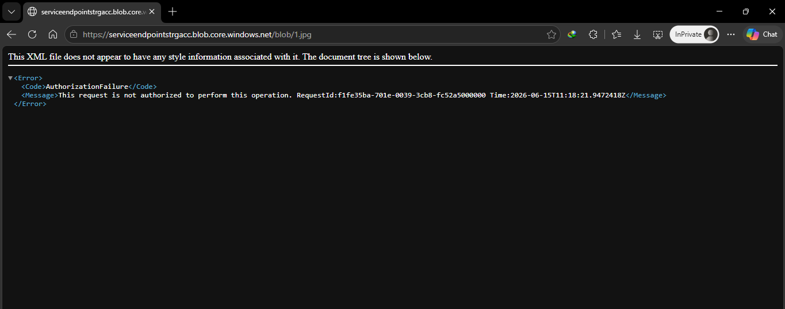
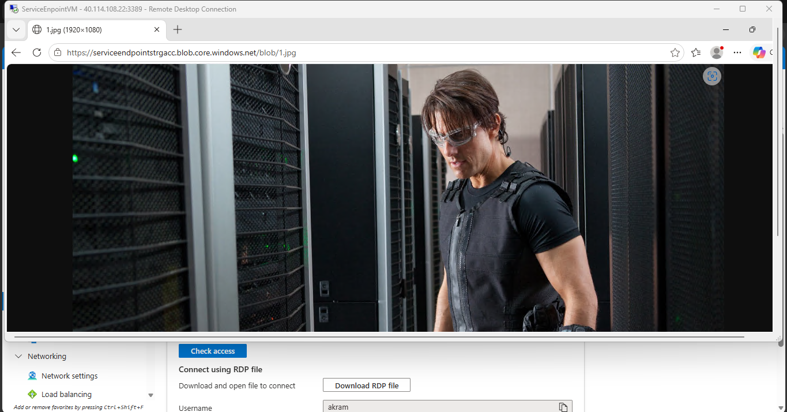

\# Secure Azure PaaS Storage Architecture via VNet Service Endpoints


\## 📌 Project Overview

This repository showcases a practical hands-on implementation of securing cloud data assets by restricting public access to Azure Blob Storage and enabling an isolated, secure network path via \*\*Azure Virtual Network (VNet) Service Endpoints\*\*. 


By shifting network configurations from an open public posture to a strict perimeter-based model, this deployment ensures that the storage infrastructure interacts exclusively with designated enterprise workloads, effectively mitigating data exfiltration risks and exposure to the public internet.


\---


\## 🏗️ Architectural Design \& Network Topology


```text

&#x20;      \[ Public Internet User ] 

&#x20;                 │

&#x20;                 ▼ (Direct Public Request)

&#x20;    ❌ HTTP 403 / Authorization Failure

&#x20;                 │

&#x20;                 ▼

&#x20;   ┌────────────────────────────────────────────────────────┐

&#x20;   │              Azure Cloud Infrastructure                │

&#x20;   │                                                        │

&#x20;   │   ┌────────────────────────────────────────────────┐   │

&#x20;   │   │  Virtual Network: ServiceEndpoint-VNet         │   │

&#x20;   │   │  Address Space: 192.168.0.0/16                 │   │

&#x20;   │   │                                                │   │

&#x20;   │   │   ┌────────────────────────────────────────┐   │   │

&#x20;   │   │   │ Subnet: default (192.168.0.0/24)       │   │   │

&#x20;   │   │   │                                        │   │   │

&#x20;   │   │   │  \[ ServiceEndpointVM ]                 │   │   │

&#x20;   │   │   │  (Private IP: 192.168.0.4)             │   │   │

&#x20;   │   │   │         │                              │   │   │

&#x20;   │   │   └─────────┼──────────────────────────────┘   │   │

&#x20;   │   │             │ (Optimized Private Routing)      │   │

&#x20;   │   │             ▼                                  │   │

&#x20;   │   │      Microsoft.Storage Service Endpoint        │   │

&#x20;   │   └─────────────┬──────────────────────────────────┘   │

&#x20;   │                 │                                      │

&#x20;   │                 ▼ (Secure Azure Backbone Mesh)         │

&#x20;   │   ┌────────────────────────────────────────────────┐   │

&#x20;   │   │  Storage Account: serviceendpointstrgacc       │   │

&#x20;   │   │  Firewall: Enabled (Selected Networks Only)    │   │

&#x20;   │   │                                                │   │

&#x20;   │   │   ┌────────────────────────────────────────┐   │   │

&#x20;   │   │   │ Container: blob / Asset: 1.jpg         │   │   │

&#x20;   │   │   │                                        │   │   │

&#x20;   │   │   │  ✅ Authorized Internal VNet Access    │   │   │

&#x20;   │   │   └────────────────────────────────────────┘   │   │

&#x20;   │   └────────────────────────────────────────────────┘   │

&#x20;   └────────────────────────────────────────────────────────┘


1. Isolation: The PaaS Storage Account (serviceendpointstrgacc) drops all internet-facing traffic outside the whitelisted network range.


2\. Path Optimization: Traffic traveling from the management workload (ServiceEndpointVM) to the storage service is

optimized to route directly over the secure Microsoft Azure backbone network instead of traversing the public internet.


3\. Definitive Validation: Direct access attempts via local external client browsers are greeted with an explicit 403 Authorization Failure, while inside-VNet components maintain uninterrupted, trusted asset delivery.


🛠️ Lab Components \& Verified Infrastructure Config

Resource Group: RG-ServiceEndpointLab (Region: East US)


Virtual Network: ServiceEndpoint-VNet (Address Space: 192.168.0.0/16)


Subnet: default (Service Endpoints configured: Microsoft.Storage)


Compute Workload: ServiceEndpointVM (Windows Server Environment, Private IP within whitelisted subnet boundary)


Storage Asset Service: serviceendpointstrgacc (LRS, Standard General Purpose v2)


Container: blob (Configured with container/blob level anonymous read access for distinct boundary verification)


🚀 Step-by-Step Implementation Matrix

Phase 1: Base Infrastructure \& Initial Vector Control

Resource Boundary Provisioning: Deployed a dedicated resource group RG-ServiceEndpointLab to enforce logical isolation.


Network Layout Matrix: Formed ServiceEndpoint-VNet and a baseline Storage Account with initial broad network accessibility.


Asset Staging: Created a public-facing container named blob, uploaded an image asset (1.jpg), and verified global reachability from a standard public endpoint.


Phase 2: Perimeter Hardening \& Endpoint Binding

Network Layer Isolation: Flipped the Storage Account Public Network Access posture from Enable from all networks to Enable from selected networks.


Subnet Affiliation: Registered the specific virtual network subnet (default) directly to the storage service's stateful network access control list (ACL).


Routing Acceleration: Enabled the Microsoft.Storage Service Endpoint extension within the target subnet properties. This automatically rewrote the routing path for target public IP ranges to flow through internal Azure routing targets.


Phase 3: Empirical Validation \& Trust Simulation

To audit the integrity of the configuration, two distinct connection planes were tested:


The Untrusted Plane (Public Internet Client): Connection requests hitting the endpoint natively from an un-whitelisted public IP range are rejected instantly by the storage front-end.


Resulting Footprint: HTTP Status Code 403 (Forbidden) with explicit error tags: This storage account's 'Firewalls and virtual networks' settings may be blocking access to storage services.


The Trusted Plane (In-VNet Workload Management): Established an RDP session into ServiceEndpointVM situated behind the secure perimeter. Accessing the precise blob asset URI (https://serviceendpointstrgacc.blob.core.windows.net/blob/1.jpg) bypasses public filters entirely, delivering the image cleanly over internal channels.


```markdown

\### 🖼️ Proof of Concept (Visual Verification)


| Public Internet Access (Blocked) | Secure VNet Access via RDP (Success) |

|---|---|

!\[403 Forbidden]<p align="center">
  
</p>
!\[Secure Success]
<p align="center">
  
</p>


🎯 Core Architectural Takeaways

Network-Level Defense in Depth: Proved that PaaS identity policies (RBAC/SAS) should be coupled with strict network layer firewalls to achieve a solid security baseline.


Public Internet Bypass: Demonstrated how Azure Service Endpoints secure the transport vector, eliminating external exposure and preserving internal data residency.


Deterministic Security Auditing: Modeled zero-trust verification practices by validating actual client failures against sandboxed network operational success.


